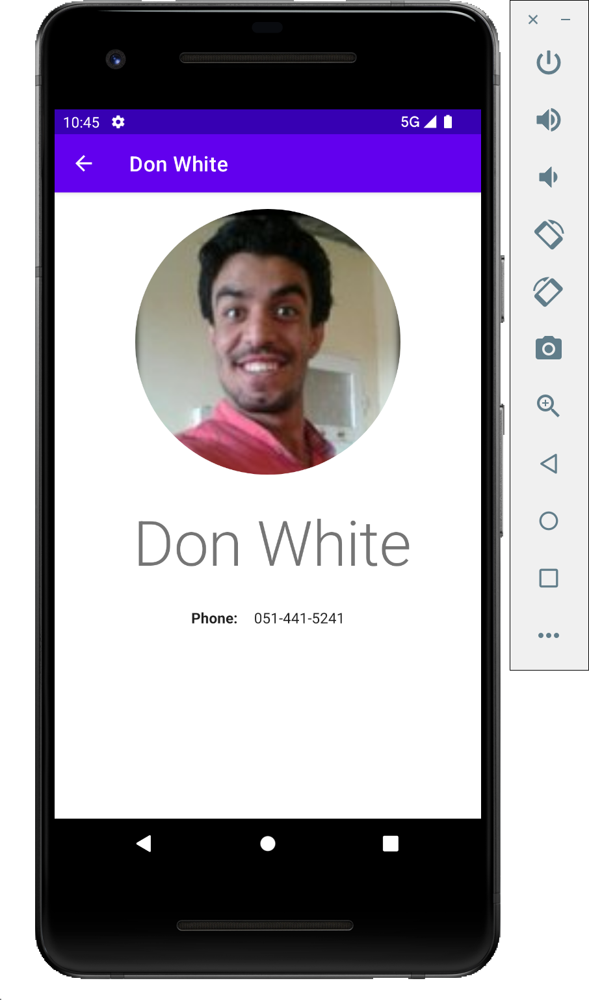

# User list Android application

## Features
Displays a list of users from [Random User Generator](https://randomuser.me/documentation).

Tapping on a user in the list opens a details screen.

Pull-to-refresh in the list will retrieve the user list from the backend again.

Day mode:
|List|Detail|Error|
|---|---|---|
||||

Night mode:
|List|Detail|Error|
|---|---|---|
||||

The error banner may appear with or without the list, depending on if we already managed to fetch data or not.

## Architecture
* The project is currently a single module.
* It uses MVVM architecture.
* It uses paging3, retrofit, and glide.

## Development
I began this project from scratch, and didn't allow myself to look at any of my other projects to find answers. I relied on my memory and Google search to help me find answers to technical questions. The official documentation (Android developer, retrofit, glide) were all helpful. I did also have to consult StackOverflow and some blog posts.

I created a [Github project ](https://github.com/caarmen/UserList/projects/1) with the issues I anticipated, before starting to code. I moved the tickets to "in progress" and "done" during development. "Done" in this case meeant merged.

I focused on sdks with which I was already familiar. I had already used all the libraries I looked at today, though it had been a few years since I looked at retrofit, and I hadn't yet looked at the experimental merged network + db paging3 apis.

### Initial development timeline

This is the time I spent on the following tasks:

|Time (minutes)|Task|Moment|
|---|---|---|
|8|Creating the github repository, project, and tickets||
|12|Creating a skeleton project with some dependencies we'll need||
|24|Setting up data binding and MVVM||
|32|Add retrofit, execute the request, and display the first user's name in the view||
|29|Add a list (`RecyclerView`) with basic UI||
|23|Improve the UI of the list||
|31|User detail screen||
|15|Error handling: add a banner if the request fails||
|16|Add pull-to-refesh||
|27|Trying to figure out what to do next: add a test? add persistence to disk with room? persistence with retrofit/okhttp cache? paging?||
|62|Add paging support with paging3| |3|Try to think about persistence with room or retrofit, let future Carmen deal with it||
|19|Fix display of user detail screen, and fix architecture issue where view was accessing model (provide backend model to ui model mapping)||
|17|Try (and fail) to do a viewmodel test. Fail because we can't inspect `PagingData` to do assertions on it||
|14|Add a UI test for the details screen||
|2|Look at mediator paging api again||

Total of the above: 334 minutes (5.5 hours).

I spent a little bit more time after that to do a couple of bug fixes and create this README.

### Analysis of time
* I spent 42 minutes just setting up the project and basic architecture. If you ever have to create a project like this in a very limited timebox, this is a time-consuming setup and can leave less time for actual development of the features.
* After this initial project setup, implementing the easy parts of the app took about an additional 146 minutes (2.4 hours). At this point, I had a functioning list and detail screen, with mostly final UI, basic error handling, and pull-to-refresh.
* Adding paging was the longest task, at 62 minutes. The average time for the other coding tasks was about 22 minutes.
* I spent 45 minutes without producing anything: trying to figure out the next "quick wins" and trying and failing some approaches. Eventually, I'm confident all these difficult challenges could be solved, but each one would take more time (combined network + db paging or retrofit cache, more interesting tests).

## Next steps
* - [ ] L: Add support for an offline mode. (#10). This could be done with an experimental api in the paging3 library: [RemoteMediator](https://developer.android.com/reference/kotlin/androidx/paging/RemoteMediator).
* - [ ] L: Add more tests. Currently there is only one integration test, testing the display of the user details screen based on the backend model. 
  - I would like to add view model tests, but it doesn't seem possible to do assertions on `PagedData` to compare between actual and expected values, based on some mock `UserModel` data
  - Doing UI tests would require some thought as to how to provide mock data for tests. One solution could be to use a mock server. Another one could be to provide an alternate `UserRepository` implementation for tests based on mock `UserModel` data.  This would require some refactoring and introduction of dependency injectionor a service locator implementation (dagger, hilt, koin, custom...)
* - [X] XS: Use round avatars

## Conclusion
Android development takes time!

This kind of exercise, where a developer creates an application from scratch in a limited timebox, only very partially represents the type of work an Android developer does daily. It can demonstrate the sdks and architectures the developer already knows.

However, such an exercise does not demonstrate very well the skills or activities of developers which are required on a daily basis: 

* Planning: estimation of tasks, splitting tasks, reasearch and discussion with other developers on the best approach to implement a feature, when multiple options exist.
* Reviewing code.
* Debugging and troubleshooting are critical skills which are practically absent from this type of exercise.
* Maintenance: In a real environment, a developer can spend a significant time on maintenance: 
  - updating an app to use new apis when sdks deprecate old ones.
    - For example, migrating to use the new "start activity for result" apis took several days in our work project, with multiple discussions on different implementation approaches
  - reporting bugs in quality bug reports to third-party sdk providers, sometimes requiring creating a bug reproduction project.
  - For example, in the last few weeks, I spent over 2 complete days on dependency updates for work:
    - the kotlin 1.6 upgrade caused compilation errors with experimental annotation apis, with multiple possible solutions involving debugging gradle configuration and tasks
    - the new appcompat library release now uses emoji2, making us migrate from the old emoji library, requiring investigation of automatic vs manual initialization of the library
    - the robolectric 4.7 upgrade introduced OutOfMemoryErrors which required troubleshooting, analyzing memory dump files
    - the activity 1.4.0 upgrade broke tests due to how we were mocking behavior of another 3rd party library
    - other upgrades with minor impacts on code (like nullaibility changes in the apis): minor but cumulative in time spent

